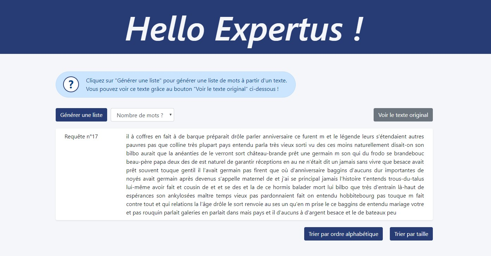

# Défi Expertus
L'application est composée d'une partie webservice pour les opérations back-end et d'une partie client pour l'affichage.

L'utilisateur peut générer une liste de mot de la taille souhaitée à partir d'un extrait de livre stocké côté webservice. Il peut ensuite trier cette liste par ordre alphabétique ou par taille de mot.
Le texte est stocké dans un fichier .txt pour éviter la mise en place d'une base de donnée. Le site est responsive et cross navigateur.

URL de l'interface client : http://localhost:8080/app-client/generator

## URL de communication avec l'API
Création de la liste de mots : http://localhost:8080/service-rest/rest/generator

Tri du texte par taille de mot : http://localhost:8080/service-rest/rest/sort

Tri du texte par ordre alphabétique : http://localhost:8080/service-rest/rest/sortAlph

Récupération du texte original : http://localhost:8080/service-rest/rest/get-text
